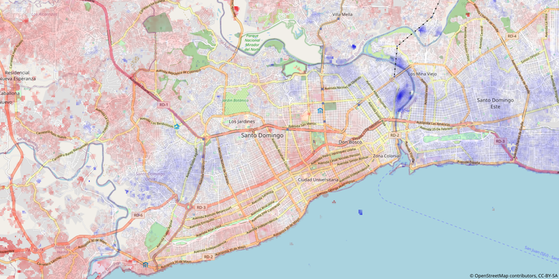

# Deformación superficial en la ciudad de Santo Domingo usando small baseline subset (SBAS)

*II Congreso Internacional de la Sociedad Dominicana de Física.
II CI-SoDoFi*

*18 al 22 de enero de 2021*

*Santo Domingo, República Dominicana*

**Sometimiento de resumen**

| | |
|:--|:-----------|
| **Título:** | Deformación superficial en la ciudad de Santo Domingo usando small baseline subset (SBAS) |
| **Tipo de participación:** | Oral |
| **Nombre de autores:** | José Ramón Martínez Batlle |
| **Institución/Facultad:** | Facultad de Ciencias, Universidad Autónoma de Santo Domingo |
| **Resumen:** | Santo Domingo, capital y ciudad más poblada de República Dominicana, localizada al sur del país, se apoya principalmente sobre formaciones rocosas de margas y calizas. En las últimas décadas, esta urbe ha experimentado un crecimiento descontrolado, y se han ocupado áreas particulamente peligrosas, como la llanura de inundación del río Ozama, compuesta por depósitos fluviales holocenos. Aunque se han estudiado otros riesgos en la ciudad (e.g. riesgo sísmico), la subsidencia debida a deformación de terreno es un fenómeno poco conocido. La única estación de referencia de operación continua (CORS), localizada en la Zona Universitaria, no detecta señales de subsidencia sostenida. En este estudio, por medio de series temporales de interferometría de radar de aperutura sintética (SBAS-InSAR), detecté cuatro áreas de la ciudad con fuertes señales de alejamiento en la línea de observación del sensor, las cuales interpreto como subsidencia de terreno sostenida. Se trata de barrios densamente poblados de la llanura de inundación del río Ozama. Las velocidades de alejamiento máximas obtenidas fueron de ~60 mm/año, con valores promedio de ~40 mm/año. Estos hallazgos son relevantes para los habitantes de estos barrios, dado que, con el tiempo, las inundaciones tenderían a amplificarse y los cimientos de las infraestructuras sensibles podrían afectarse (e.g. Teleférico de Santo Domingo). |
| **Palabras clave:** | interferometría de radar de apertura sintética (InSAR), serie temporal, subsidencia de terreno, llanura de inundación |

