```{r setup, include=FALSE}
knitr::opts_chunk$set(echo = FALSE)
```

# Motivation

##

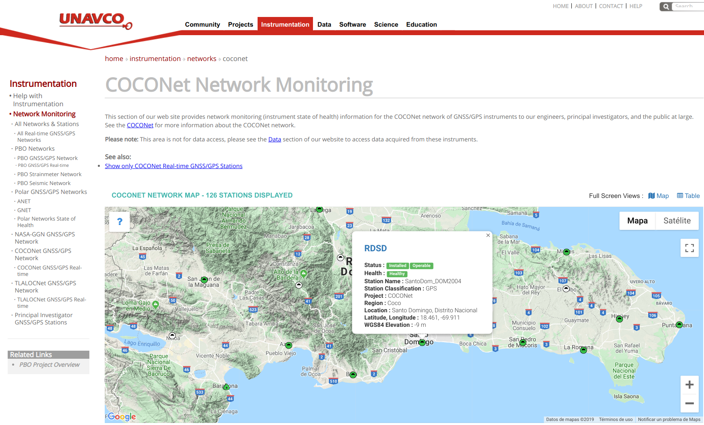

## 

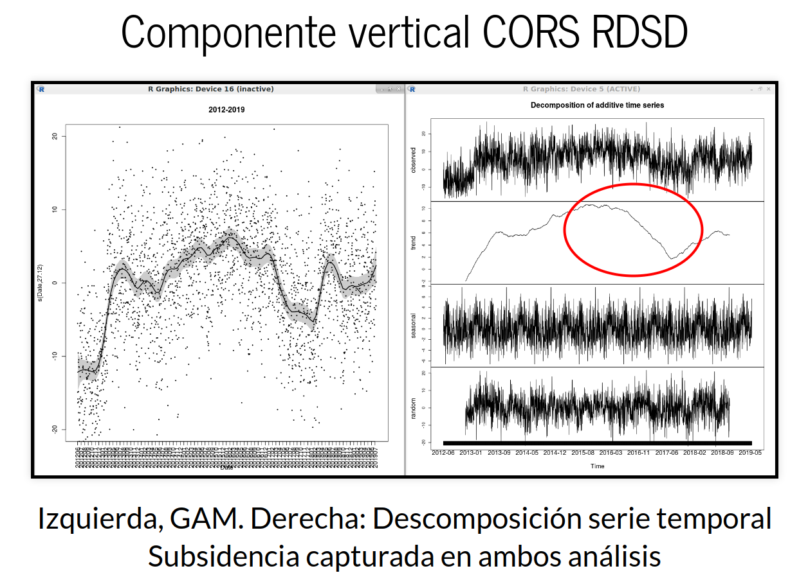{width=70%}

##

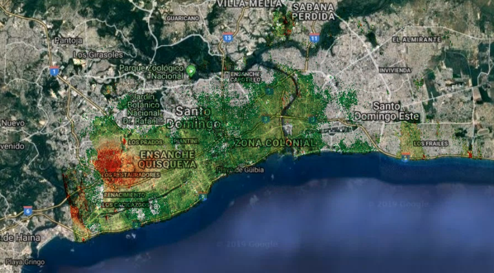

# Context

##

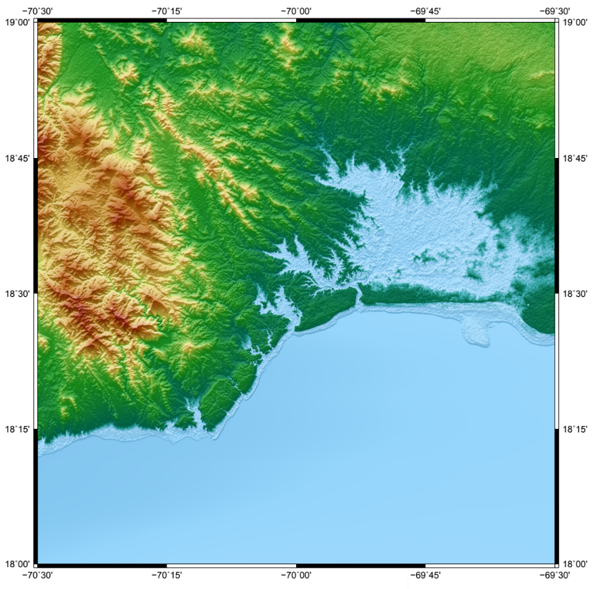{width=55%}

##

![Geological map [@sgn2020mapa]](img/geological-map.jpg)


# InSAR and derivatives

##

{width=45%}

##

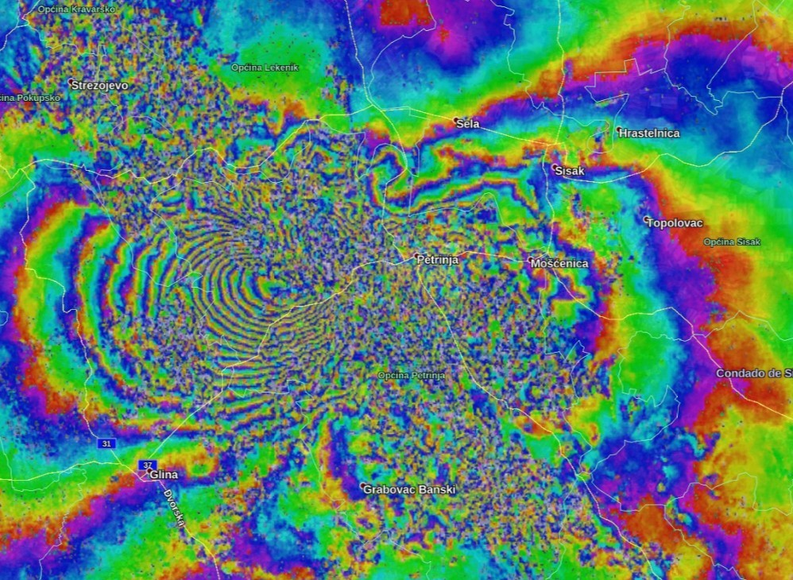{width=70%}

<!-- ## -->

<!-- 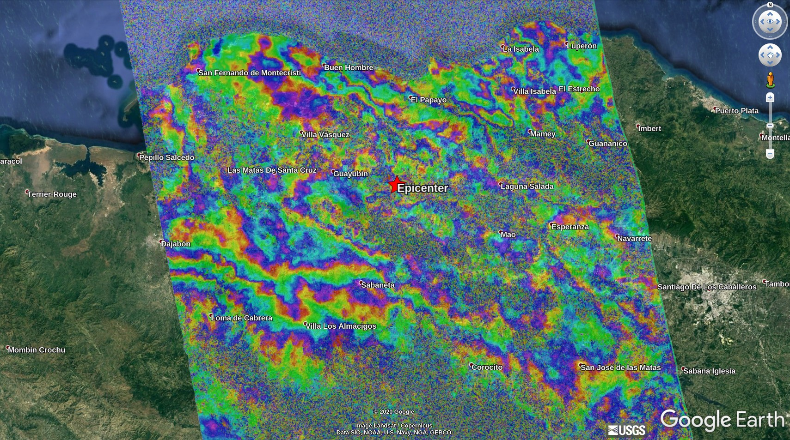 -->

##


## 

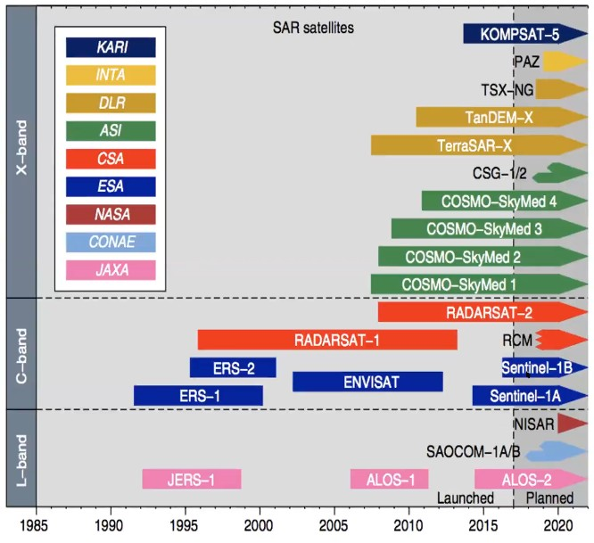{width=65%}

## Interferogram


<!-- ## Workflow for creating interferograms -->

<!-- 1. Align the reference and repeat images to sub-pixel accuracy -->

<!-- 2. The second step is to multiply the two SLC images to form the complex interferogram -->

<!-- 3. Extract the phase of the interferogram -->

<!-- ## -->

<!-- ![Phase of the interferogram [@sandwell2011insar]](img/generic-workflow.jpg){width=80%} -->


##

![Contributions to phase [@sandwell2011insar]](img/contributions-to-phase.jpg)

##

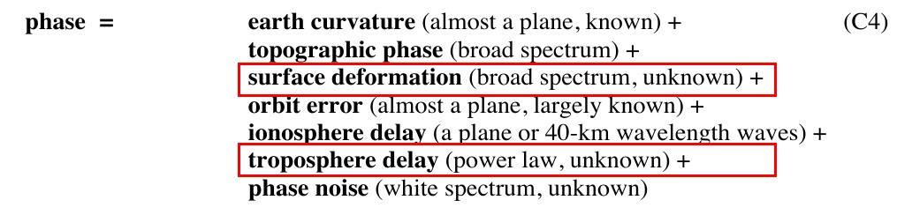

## Forming interferograms in GMTSAR

##

![Workflow in GMTSAR, 2-pass processing [@sandwell2011insar]](img/p2p-processing.jpg){width=35%}

# Materials and methods

## SBAS

- This technique uses a combination of DInSAR produced by **data pairs on a small orbital separation** (baseline) in order to limit the spatial decorrelation

- Possibly, **more than one independent acquisition subset will be generated**; thus, the latter have to be 'linked' each others.

- Independent SAR acquisition datasets, separated by large baselines, are linked by the application of the **SVD method, increasing the observation temporal sampling rate**

[@berardino2002new;@casu2011deformation]

<!-- ##  -->

<!-- 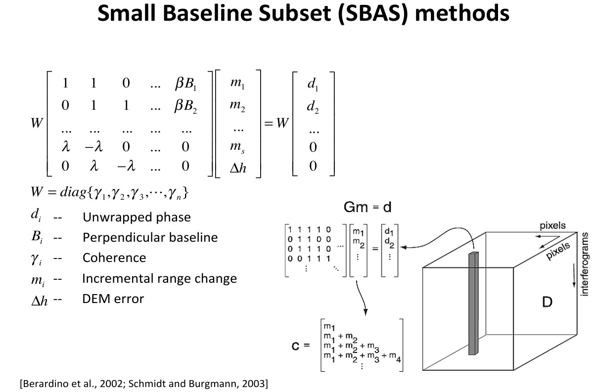 -->

##

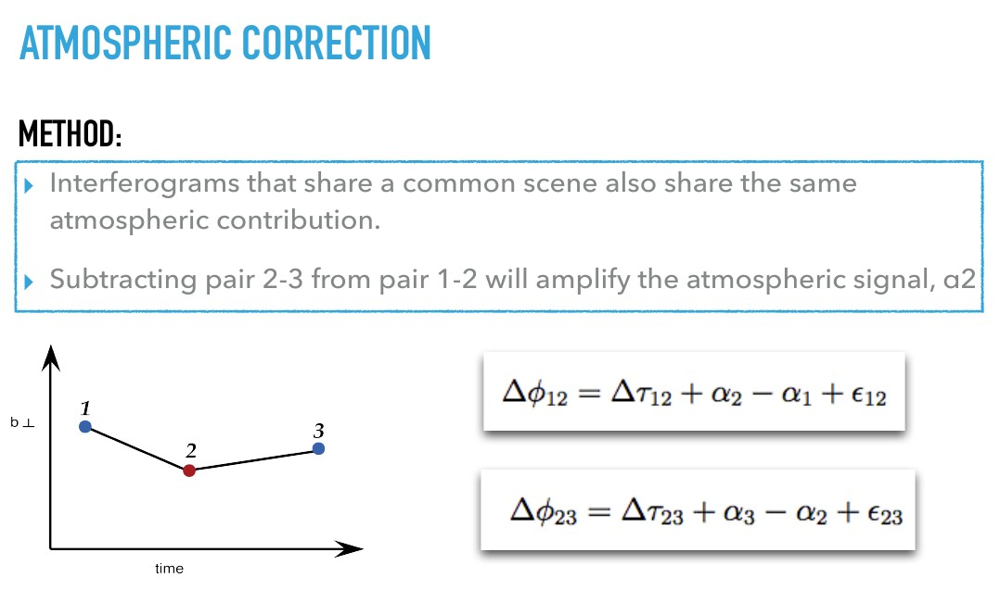

##

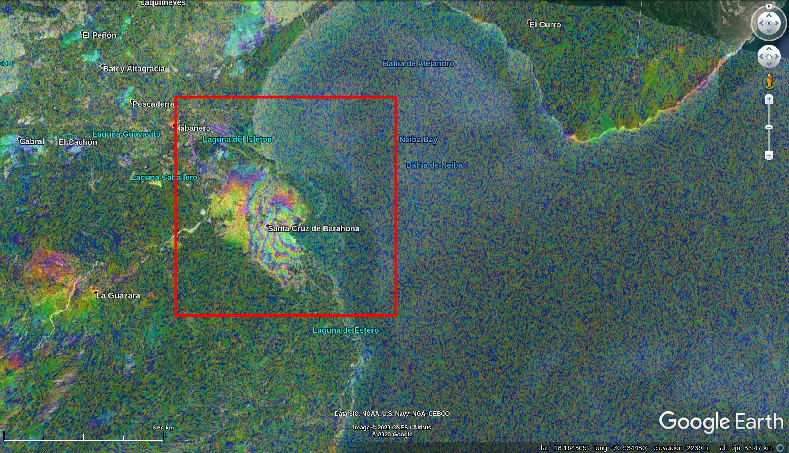

## Scenes

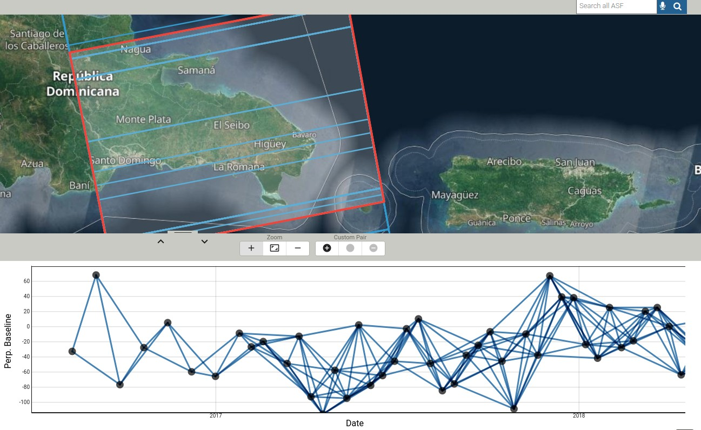

## 

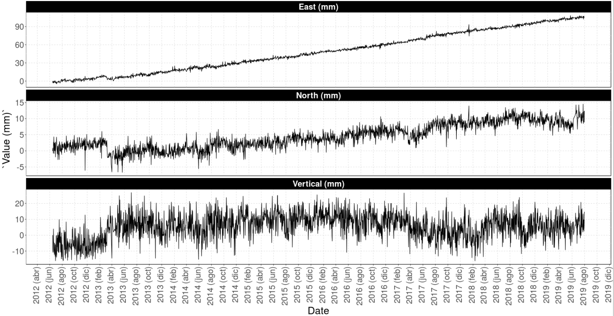

## u-blox GNSS receiver

- TESTED with recent SBAS, not used for the 2016-2018 time-series.

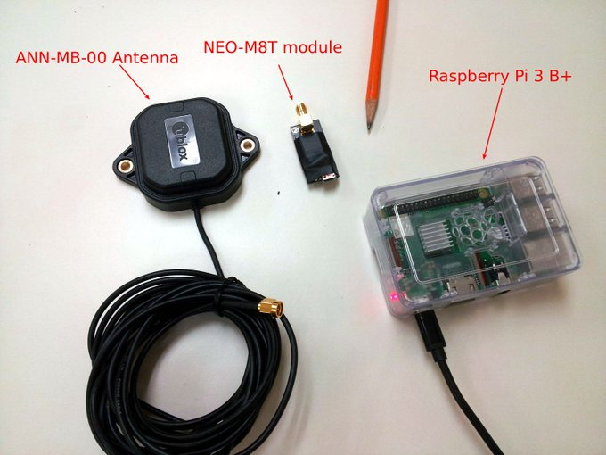


## <span style="font-size:60%;">Parts list</span>

| Fecha       | Parte                                                             | Precio |
|-------------|-------------------------------------------------------------------|-------:|
| 7/jul/2019  | Raspberry Pi 3 B+                                                 |  US$38 |
| 8/jul/2019  | u-blox NEO-M8T                                                    |  US$75 |
| 16/jul/2019 | Pantalla táctil Waveshare 480x320                                 |  US$33 |
| 17/ago/2019 | Atenna TOPGNSS (sustituyó antena u-blox)                          |  US$53 |
| 18/ago/2019 | Impresión 3D de caja, [repo GitHub de Taroz](https://github.com/taroz/TouchRTKStation) |  US$37 |
| 17/ago/2019 | 2 Baterías 8800mAh NP-F970 (Sony) con cargador                    |  US$38 |
| 21/ago/2019 | Adaptador para batería, conversor a ~5V, cables                   |  US$28 |
| 13/sep/2019 | Trípode                                                           |  US$45 |
| 25/oct/2019 | Palo 2 m con nivel de burbuja                                     |  US$65 |
|             | __Total sin ensamblar__                                           | __US$161__ |
|             | __Total ensamblada__                                              | __US$302__ |
|             | __Total ensamblada con trípode__                                  | __US$347__ |
|             | __Total ensamblada con trípode y palo__                           | __US$412__ |

##

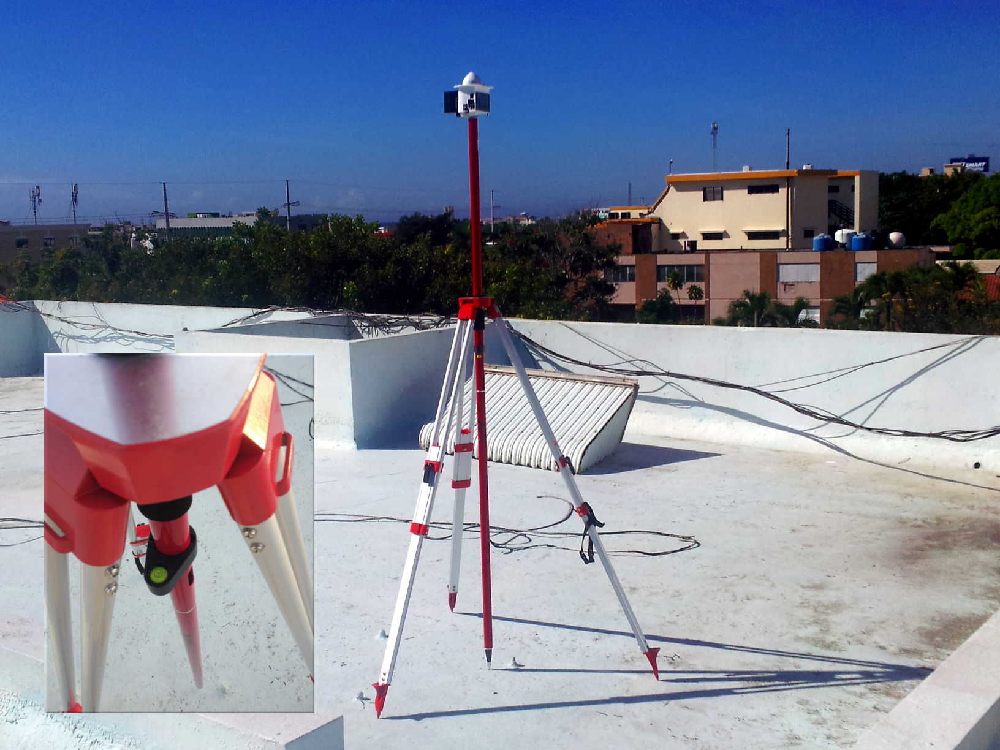

# Results

##

- Al menos cuatro áreas de la ciudad con fuertes señales de alejamiento en la línea de observación del sensor; barrios densamente poblados de la llanura de inundación del río Ozama.

- Una señal muy intensa y concentrada en área pequeña, próximo a cañada, sector Las Malvinas.

- Las velocidades de alejamiento máximas obtenidas fueron de ~60 mm/año, con valores promedio de ~40 mm/año.

##

{width=60%}

## 

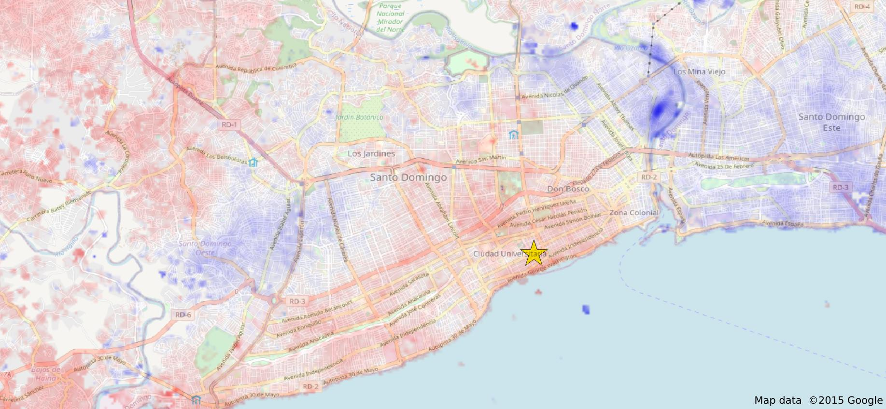

## 

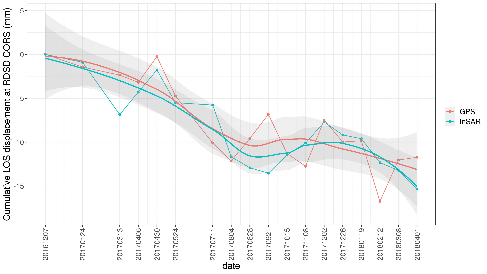

##

<iframe width="100%" height="600" src="https://geofis.xyz/lm/index.php/view/map/?repository=sbassd1618&project=lizmap" frameborder="0" allow="accelerometer; autoplay; encrypted-media; gyroscope; picture-in-picture" allowfullscreen="" data-external="1"></iframe>

<span style="font-size:60%;">[https://geofis.xyz/lm/index.php/view/map/?repository=sbassd1618&project=lizmap](https://geofis.xyz/lm/index.php/view/map/?repository=sbassd1618&project=lizmap)</span>

##

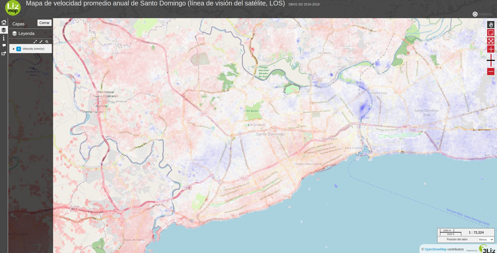

<span style="font-size:60%;">[https://geofis.xyz/lm/index.php/view/map/?repository=sbassd1618&project=lizmap](https://geofis.xyz/lm/index.php/view/map/?repository=sbassd1618&project=lizmap)</span>


# Discussion

- Aunque se requieren más observaciones (+tracks, +comprobación de terreno), las señales observadas en la **llanura de inundación del río Ozama son atribuibles a subsidencia**, aunque las causas de ésta podrían ser varias (e.g. extracción de agua subterránea, asentamiento de sedimentos no consolidados).

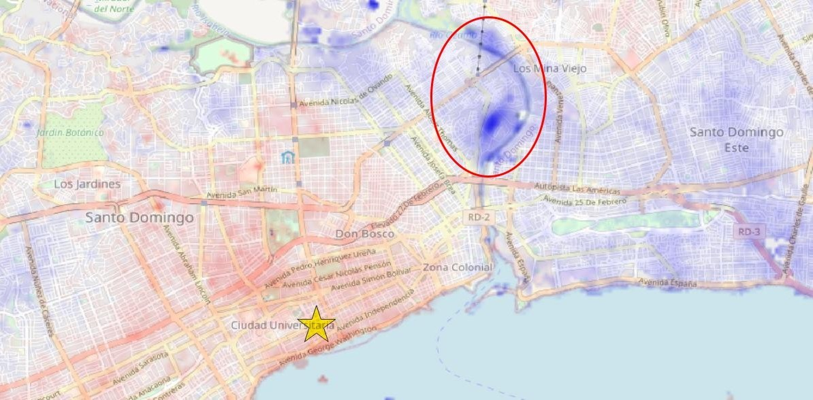{width=65%}

##

- La señal en el sector Las Malvinas, es atribuible a **asentamiento de materiales de relleno de cañada**.

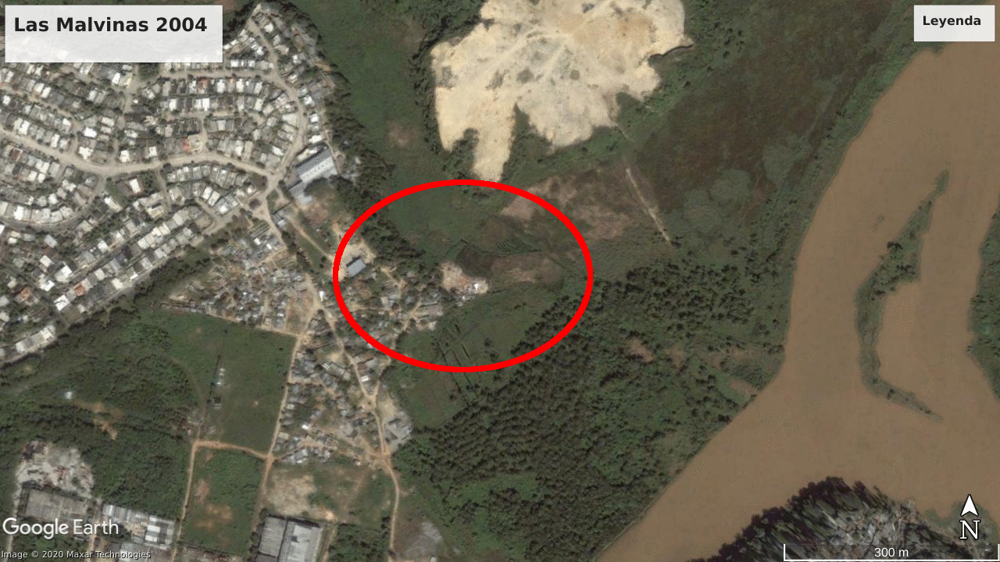

##

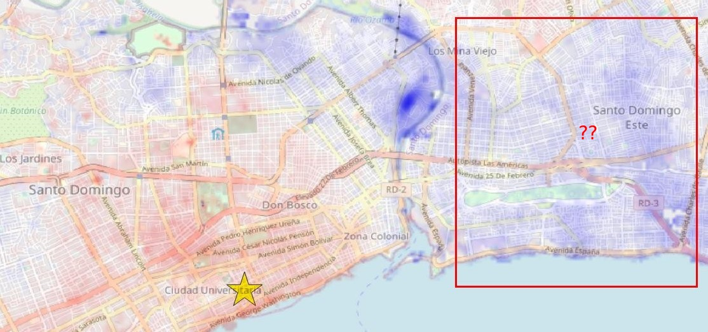

##

- Estos hallazgos **son relevantes para los habitantes de estos barrios**, dado que, con el tiempo, las **inundaciones tenderían a amplificarse** y los cimientos de las infraestructuras sensibles podrían afectarse (e.g. Teleférico de Santo Domingo). 

- URL de la presentación: https://geofis.github.io/sd-sbas/

- Correo: jmartinez19\@uasd.edu.do


# References

## 
